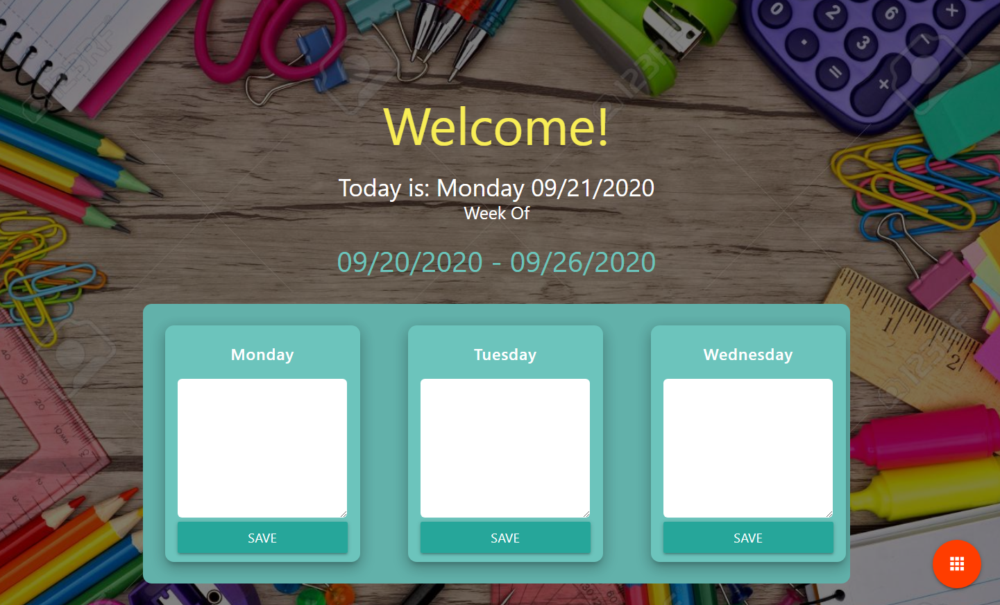
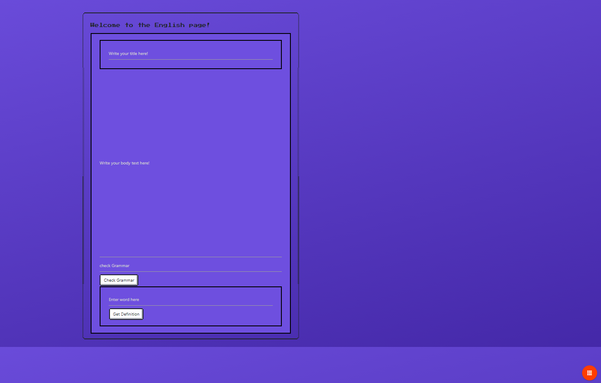
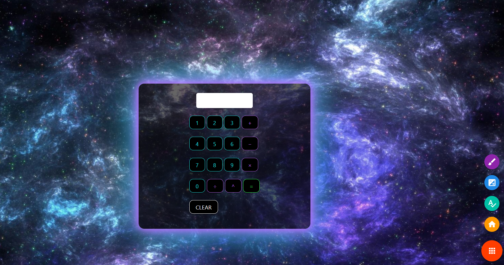
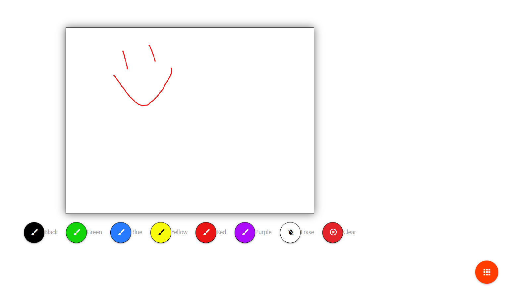

# HomeworkHelper
*This “new norm” remote learning environment can be challenging and… boring. We’ve created an app to help your kids stay on track with homework, and enjoy it!*

Team Codename:
  Homework Heros
  
Team Members:
-Joy  -Vincent -Rebecca

https://vscacchitti.github.io/HomeworkHelper

#Description: Created for grades K-12. Homework Helper is an online platform to keep track of assignments. This application also assists students with their homework in the form of a calculator, grammar bot, and spell checker. We’ve added a place for artwork as well! 

#Motivation: Due to Covid-19, students have had to move to remote online learning. We’ve heard from friends and family that this switch to online learning has been difficult for some kids and we wanted to help. Inspired by the old school Trapper Keepers, we’ve created an electronic version that is visually appealing and user friendly.

#User story:
AS A student
I WANT an online application to help me with and keep track of my homework
SO THAT I can work on my homework assignments more easily from home.

Technology used:
HTML, Javascript, CSS, jQuery, AJAX, Grammarbot API, Twin Word API, slider.js, NES.css, GitHub

Features for future development:
Full 12 month calendar access.
Enhancements to learning for high school students. (i.e. enhanced calculator functions, science app)
Score keeper – the more you use the app, the higher your score. Could also create an API to tie in your actual grade. Teachers can use this to help track which students are staying engaged and on track with assignments.

